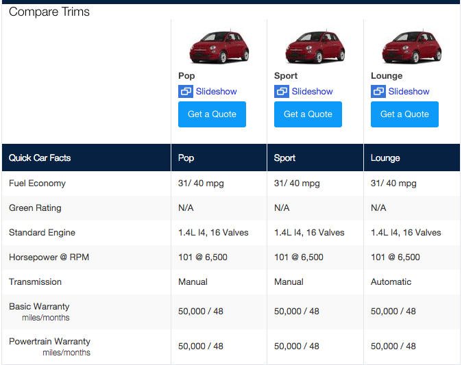

# The Simulation

The goal of this simulation is to evaluate how well you can use the tools provided to build a real-world application. We're not looking for a work of art (i.e. it doesn't have to be pretty), but it does have to be useable. We will evaluate you on how much you can accomplish in the time provided and how well you craft the solution. There is no right answer, but we recommend sticking to best practices (both in Rails and in HTML/CSS/JS) as you build the application.

## First, Some Terminology

In the auto industry, there are a set of standard terms that are used when referring to vehicles:

*   **Make:** is a car's brand name (e.g. Honda, Toyota, BMW)
*   **Model:** is a category of vehicle (a product name, if you will, e.g. Accord, Corolla, 3-series)
*   **Trim:** is a category of model (a version of a product, e.g. a Honda Accord might have trims called 4-door Manual EX and 4-door Automatic EX)

## Your Goal

To create an application that allows a user to compare 4 different vehicles. The data we would like to see displayed within the comparison tool are:

*   Vehicle image
*   Year, Make, Model, and Trim (e.g. 2015 Honda Accord 4-door EX)
*   MSRP
*   Invoice Price
*   MPG City
*   MPG Highway
*   Transmission

## Your Tools

We've already set you up with the following:

*   A Rails 4.1.1 app called "rails_interview" (located at ~/Sites/rails_interview) connected to a sqllite database called comparator_development.

## The Data

We've provided you with a set of CSV and image files (available in /db/*.txt) that contain all the vehicle-related data you will need to build a comparison tool. The files are as follows:

*   **Makes:** simply contains a list of makes. To keep it simple, we're just sticking to Honda for this sim.
*   **Models:** contains a set of Honda models.
*   **Trims:** contains a set of Honda trims. The default_matched_image column provides the name of the image file that belongs to the given trim.

## Steps You Should Take

### Create The Models

Create the models that you see fit for representing the data you will need for the comparison tool, then import the data from the CSV files (*.txt extensions) into the database.

### Create Controllers

Create any controllers you need to be able to build the comparison tool. REST is a best-practice, but if you do not think it is appropriate in this scenario, you may code your controller(s) differently.

### Create Views

Create the necessary view(s) for the comparison tool. You should create a way to select 4 vehicles and then display them in a way that makes sense. Ultimately, for the comparison you want to see the cars you selected and their interesting attrbiutes (as defined above) in a simple to view way.  Here is an example from yahoo autos:

</img>

The example above doesn't use all the attributes we have for the vehicles (MSRP for example), make sure you include all of them!

The way in which you build the selection interface is completely up to you. Think about what makes for a good user experience, though.

### Make It More Useable

Some users aren't sure what some of the terms mean (e.g. MSRP). We think it would make their lives easier if they could see a short description of each term when they hover over it within the comparison tool.

For users with smaller screen resolutions, it's hard to keep track of which car they are looking at. A handful have asked us "can you make it so that when I scroll down, the images of the vehicles just stay at the top of the screen?" We think it's a good idea, so let's implement this feature.

## Questions?

If you have any questions right now or during the simulation, just come ask us.

  

</body>
</html>
